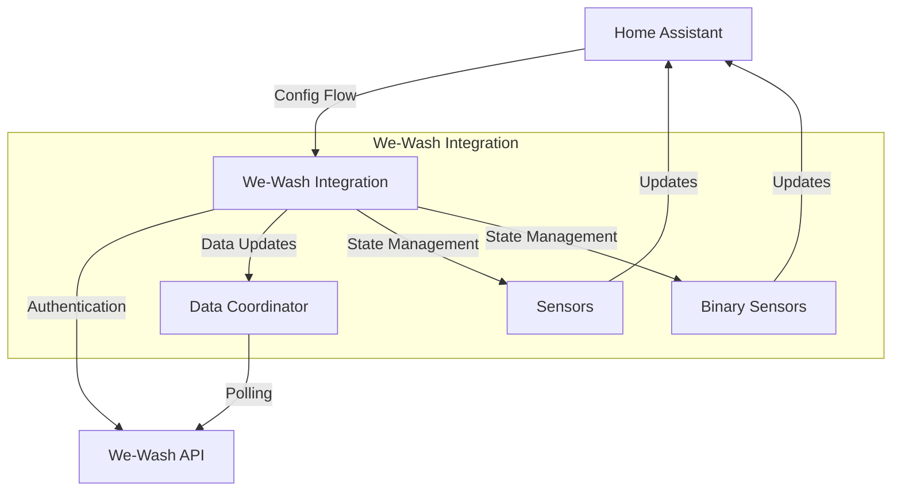
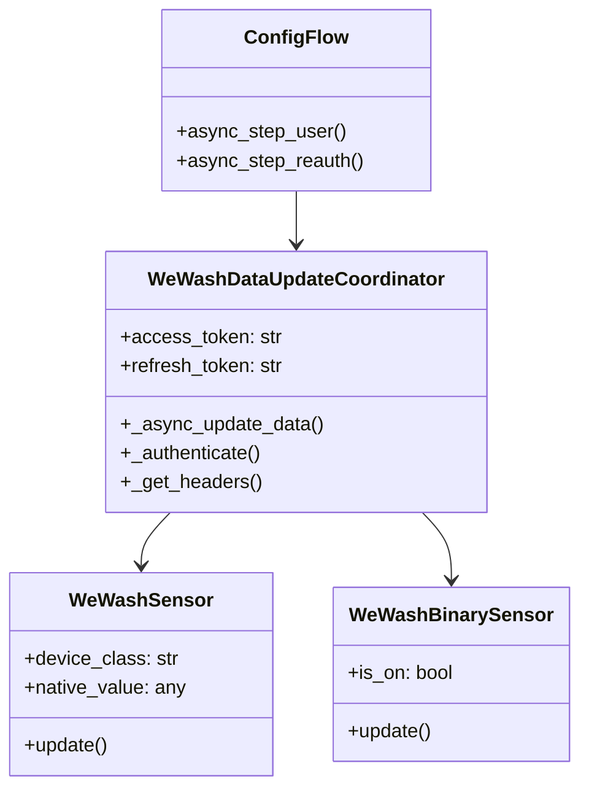
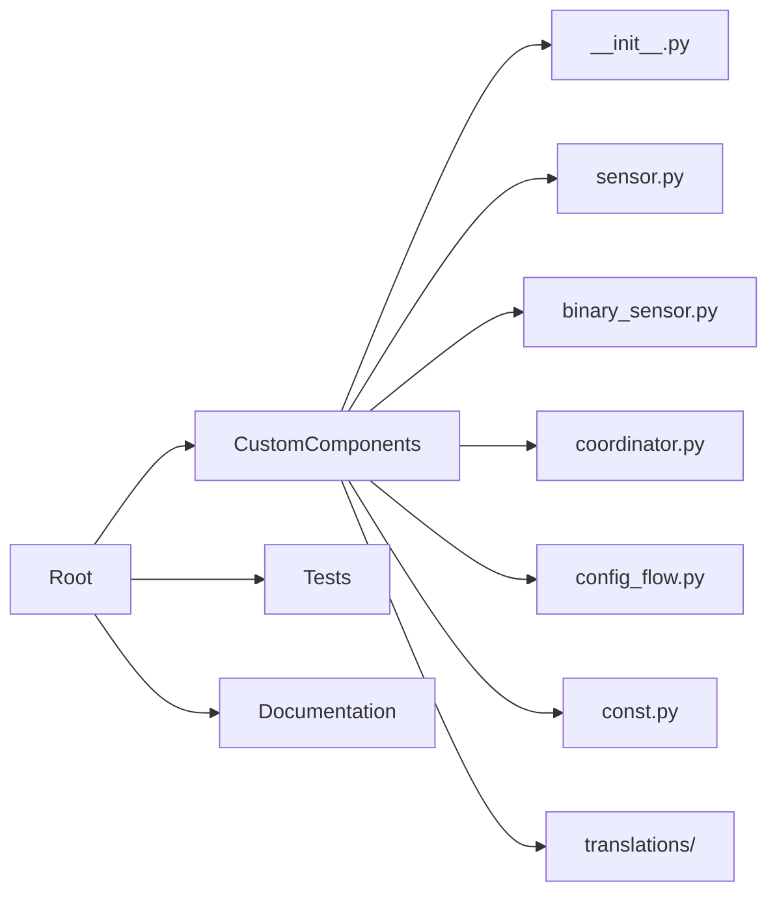
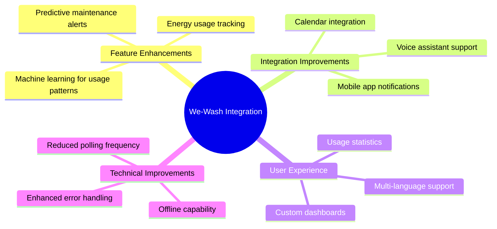
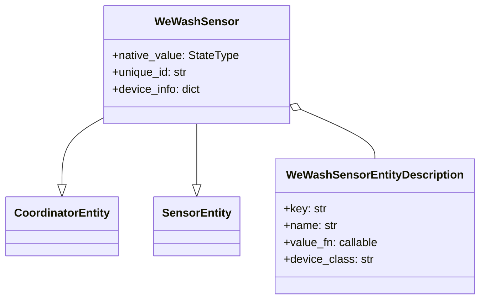
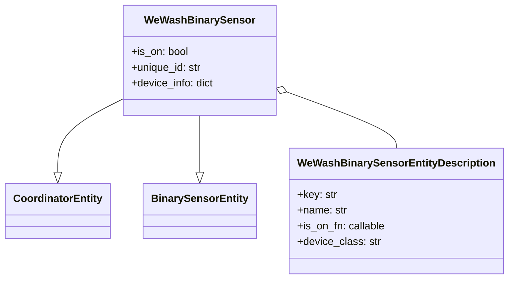
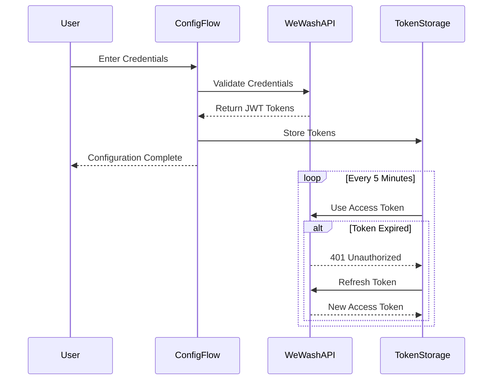
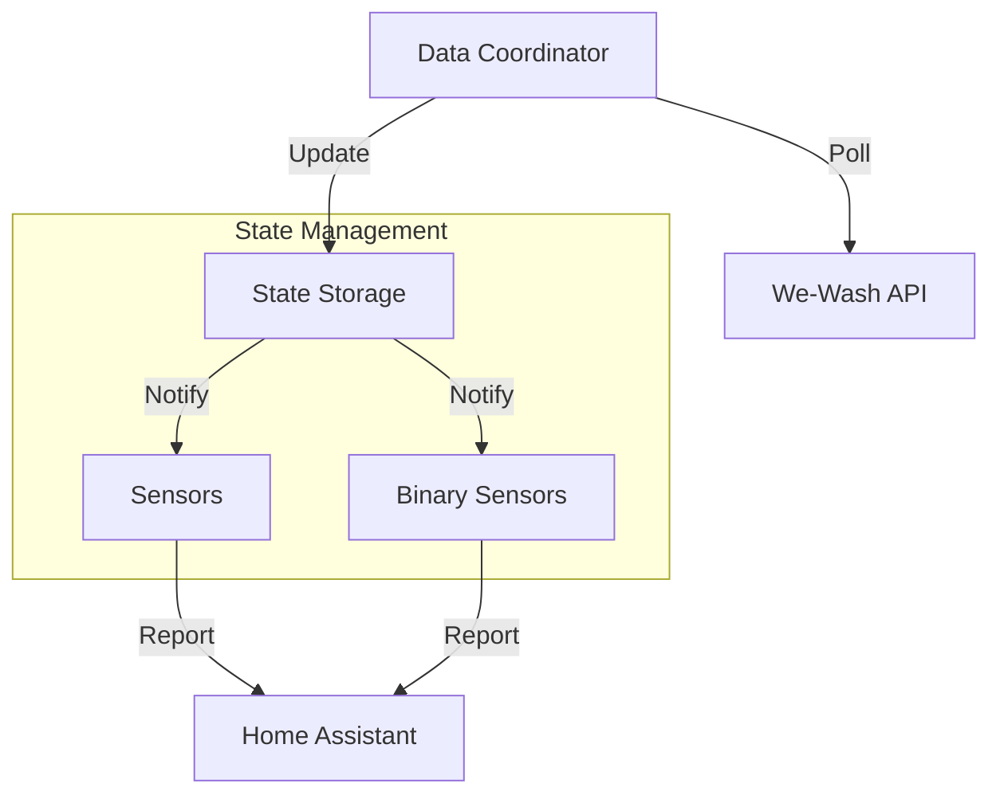
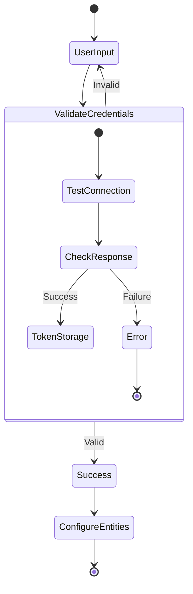

# We-Wash Home Assistant Integration - Technical Analysis

This document provides a comprehensive analysis of the We-Wash Home Assistant Custom Component from multiple perspectives: architecture, development, and product management.

## 1. Product Overview

The We-Wash Home Assistant integration is a custom component that enables users to monitor and interact with We-Wash laundry systems directly from their Home Assistant installation. This integration bridges the gap between smart home automation and shared laundry facilities.

### Key Features
- Real-time monitoring of washer and dryer availability
- Account balance tracking
- Reservation status monitoring
- Automated updates every 5 minutes
- Integration with Home Assistant's notification system

### Target Users
- Residents of buildings with We-Wash laundry systems
- Home automation enthusiasts
- Property managers looking to integrate laundry monitoring

## 2. Technical Architecture

### 2.1 High-Level Architecture

### 2.2 Component Structure

### 2.3 API Integration

The integration communicates with We-Wash's backend services through several REST endpoints:

- Authentication: `https://backend.we-wash.com/auth`
- User Info: `https://backend.we-wash.com/v3/users/me`
- Laundry Rooms: `https://backend.we-wash.com/v3/users/me/laundry-rooms`
- Reservations: `https://backend.we-wash.com/v3/users/me/upcoming-invoices`

Authentication uses a JWT-based token system with refresh capabilities.

## 3. Development Analysis

### 3.1 Code Organization

### 3.2 Key Components

1. **Data Coordinator (`coordinator.py`)**
   - Manages data updates from We-Wash API
   - Handles authentication and token refresh
   - Implements error handling and retry logic
   - Uses asyncio for non-blocking operations

2. **Config Flow (`config_flow.py`)**
   - Handles user configuration
   - Implements re-authentication flow
   - Validates user credentials

3. **Sensors (`sensor.py` & `binary_sensor.py`)**
   - Account balance sensor
   - Machine availability sensors
   - Reservation status sensors

### 3.3 Dependencies
- aiohttp >= 3.8.0 for async HTTP requests
- Home Assistant core libraries
- Python 3.x

## 4. Product Management Insights

### 4.1 Value Proposition
1. **Convenience**
   - Real-time machine availability
   - Integration with existing smart home setup
   - Automated notifications

2. **Time Management**
   - Reservation tracking
   - Status notifications
   - Account balance monitoring

3. **Smart Home Integration**
   - Automation possibilities
   - Custom notifications
   - Dashboard integration

### 4.2 Future Enhancement Opportunities

### 4.3 Release Management
Currently at version 1.0.0, following semantic versioning principles:
- Major version: Breaking changes
- Minor version: New features
- Patch version: Bug fixes

## 5. Security Considerations

1. **Authentication**
   - JWT-based token system
   - Automatic token refresh
   - Secure credential storage

2. **Data Protection**
   - No local storage of sensitive data
   - Encrypted communication
   - Token-based API access

3. **Error Handling**
   - Graceful degradation
   - User-friendly error messages
   - Automatic retry mechanisms

## 6. Testing Strategy

1. **Unit Tests**
   - Component initialization
   - Configuration validation
   - Sensor state management

2. **Integration Tests**
   - API communication
   - Authentication flow
   - Data update coordination

3. **End-to-End Tests**
   - Configuration flow
   - Sensor updates
   - Error handling

## 7. Deployment and Distribution

The integration is distributed through HACS (Home Assistant Community Store) as a custom repository:

1. **Installation Process**
   - HACS custom repository addition
   - Automated installation
   - Configuration through UI

2. **Update Process**
   - HACS-managed updates
   - Automated version checking
   - Change log documentation

## 8. Documentation

1. **User Documentation**
   - Installation guide
   - Configuration instructions
   - Troubleshooting guide

2. **Developer Documentation**
   - API documentation
   - Component architecture
   - Contributing guidelines

## 9. Support and Maintenance

1. **Issue Management**
   - GitHub issue tracker
   - Feature request process
   - Bug reporting template

2. **Community Support**
   - GitHub discussions
   - Version compatibility
   - Regular updates

## 10. Metrics and Monitoring

1. **Performance Metrics**
   - Update frequency
   - API response times
   - Error rates

2. **Usage Metrics**
   - Installation count
   - Active installations
   - Feature usage

## 11. Technical Implementation Details

### 11.1 Sensor Implementation

The integration implements two types of sensors:

#### Regular Sensors (`sensor.py`)

Key sensors include:
1. Balance Sensor
   - Tracks user's credit balance
   - Uses currency device class
   - Updates every 5 minutes

2. Machine Availability Sensors
   - Tracks available washers per laundry room
   - Tracks available dryers per laundry room
   - Numeric value representation

#### Binary Sensors (`binary_sensor.py`)

Binary sensors include:
1. Reservation Status
   - Indicates when reserved machines are ready
   - Uses running device class
   - Dynamic creation based on active reservations

### 11.2 Authentication System

The authentication system employs a robust multi-layer approach:

Key Authentication Features:
1. JWT-based token system
2. Automatic token refresh
3. Secure credential storage
4. Session persistence
5. Error handling with automatic reauthorization

### 11.3 State Management

The integration employs a centralized state management system through the Data Update Coordinator:

Key State Management Features:
1. **Centralized Updates**
   - Single source of truth
   - Coordinated refresh cycles
   - Efficient API usage

2. **Error Handling**
   - Graceful degradation
   - Automatic retry mechanism
   - Error state propagation

3. **State Persistence**
   - Configuration storage
   - Token management
   - State recovery after restarts

### 11.4 Configuration Flow

The configuration system implements a user-friendly setup process:

Configuration Features:
1. **User Input Validation**
   - Required field checking
   - Credential format validation
   - Connection testing

2. **Error Handling**
   - Clear error messages
   - Retry capability
   - User guidance

3. **Configuration Storage**
   - Secure credential storage
   - Configuration versioning
   - Migration support

### 11.5 API Integration Patterns

The integration follows several key patterns for API interaction:

1. **Request Rate Limiting**
   - 5-minute update interval
   - Coordinated updates
   - Cache management

2. **Error Recovery**
   - Exponential backoff
   - Token refresh handling
   - Connection error recovery

3. **Data Transformation**
   - Normalized data structures
   - Type conversion
   - Unit standardization

### 11.6 Event System

The integration leverages Home Assistant's event system for:

1. **State Changes**
   - Machine availability updates
   - Balance changes
   - Reservation status changes

2. **Notifications**
   - Machine ready alerts
   - Error notifications
   - Balance warnings

3. **Automation Triggers**
   - Custom automation support
   - Event-based actions
   - Condition monitoring

## Conclusion

The We-Wash Home Assistant integration is a well-structured custom component that provides valuable functionality for users of We-Wash laundry systems. Its architecture follows Home Assistant best practices, with clear separation of concerns and robust error handling. The product roadmap suggests opportunities for enhancement while maintaining stability and security.
